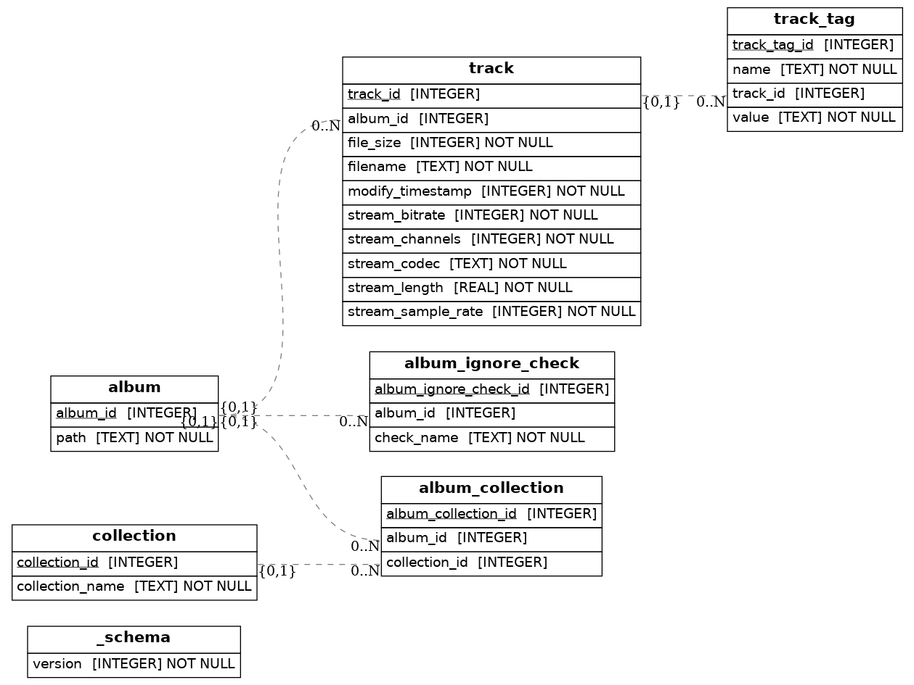

# Developing `albums`

## Prerequisites

- Python 3.14 available (install with uv or pyenv etc.)
- [poetry](https://python-poetry.org/)
- `make` (recommended)

## Building

Run `make` to install dependencies + lint + test + package. Or use `poetry` -
see Makefile.

The first time dependencies are installed, it needs to be in an environment with
Python 3.14. `poetry install` will cache the Python installation so it does not
need to run in a special environment afterwards. Run the local app with
`poetry run albums`.

## Developing

- Copy
  [sample/config.toml](https://github.com/4levity/albums/blob/main/sample/config.toml)
  to the project root and edit it to configure a local environment for manual
  testing or regular use.
- `make fix` to automatically fix lint and format errors
- `make preview` to preview these docs (requires
  [GraphViz](https://graphviz.org/))
- Query albums.db with e.g.
  `albums sql "SELECT * FROM album WHERE album_id < 50;"`

## Database Schema

`make diagram` generates this image.
