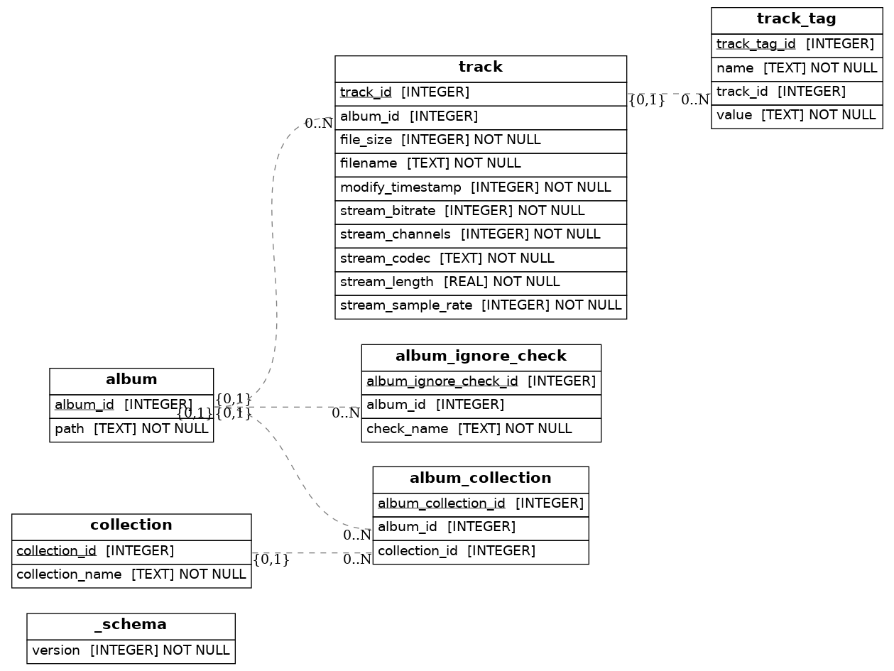

# Developing

## Prerequisites

- [uv](https://docs.astral.sh/uv/) (manages the Python installation and project
  dependencies)
- [Node.js](https://nodejs.org/) 22.18+ (lint tool dev dependencies)
- `make`
- `shellcheck` on PATH (non-Linux only; on Linux, `make lint` downloads a pinned
  release into `.cache/shellcheck/`)

## Overview

Run `make` to install dependencies + static checks (lint, format, types,
spelling) + test. If no suitable Python (3.12+) is installed, uv will download
and use one automatically.

The dependency lockfile (`uv.lock`) is committed, and `make install` fails if it
is out of date with `pyproject.toml`. After changing dependencies, run `uv lock`
(or `uv add`/`uv remove`) and commit the updated lockfile.

The lint tools are Node.js dev dependencies defined in `package.json` with
versions pinned in `package-lock.json`. `make install-js` installs them into
`node_modules/`; `make static` and `make fix` run it automatically, and it fails
if the lockfile is out of date with `package.json`.

### Run

Run the app with `uv run albums [...]`. The first time you do, you may run
`uv run albums --db-file albums.db init` in the project directory, which will
create a "local" `albums.db` there for a test environment (separate from the db
used by a regular installation of `albums`).

### Project Files and Folders

| Path                | Description                                          |
| ------------------- | ---------------------------------------------------- |
| `.github/workflows` | Github workflows (build/publish/docs)                |
| `docs/`             | This documentation                                   |
| `src/albums/`       | Python application (structure below)                 |
| `scripts/`          | Development scripts (e.g. `version.py`)              |
| `tests/`            | Tests!                                               |
| `Makefile`          | The Makefile                                         |
| `hooks/`            | Git hooks (commit-msg, pre-commit, pre-push)         |
| `package.json`      | Node.js dev dependencies (lint tools)                |
| `pyproject.toml`    | Project definition, tool configuration, dependencies |
| `zensical.toml`     | Configuration for this documentation                 |

(not all files/folders included)

### Versioning and Packaging

The package version is derived from git tags at build/install time, using
[hatch-vcs](https://hatch.pypa.io/latest/plugins/builder/hatch-vcs/) (a wrapper
around [setuptools-scm](https://setuptools-scm.readthedocs.io/)). A commit that
is tagged `vX.Y.Z` builds as `X.Y.Z`, and any later commit builds as
`X.Y.Z.postN+<commit>` (plus a date suffix if the working tree is dirty), so
every commit has a distinct version.

During install or build, the computed version is written to
`src/albums/_version.py` (gitignored), which the app reads for
`albums --version`. `scripts/version.py` prints the same version for the current
checkout, and `write` writes the `_version.py` file:

- `make package` builds the sdist and wheel in `dist/` (used to publish to PyPI)
- `make pyinstaller` writes the version, then builds a standalone executable in
  `dist/pyinstaller/<platform>/albums/` with
  [PyInstaller](https://pyinstaller.org/)
- `make docs` injects the version into the built docs site

### Python Project Structure

| Package       | Description                                               |
| ------------- | --------------------------------------------------------- |
| `app`         | App context (db, config, console) shared across functions |
| `config`      | Configuration types, defaults, serialization              |
| `entities`    | ORM models (Album, Track, PictureFile, OtherFile)         |
| `checks`      | Check/fixer implementations and orchestration             |
| `cli`         | Entry point and command implementations                   |
| `database`    | DB creation, migrations, queries                          |
| `interactive` | UI for interacting with checks \u0026 configuration       |
| `library`     | Scan library, import album, sync to destination           |
| `picture`     | Get picture info, caching picture scanner                 |
| `tagger`      | Read/write metadata in media files                        |
| `words`       | Simple text generation e.g. pluralize words               |

### Key Types to Know

- **`Context`** (`app.py`) - Carries shared state (db engine, config, console)
  across invocation.
- **`Album`/`Track`/`PictureFile`/`OtherFile`** (`entities.py`) - SQLAlchemy ORM
  models representing the data model.
- **`CheckConfiguration`** (`checks/check_types.py`) - Per-check config dict
  type.
- **`Fixer`/`CheckResult`** (`checks/check_types.py`) - Problem reporting and
  fix contracts.

## Adding Functionality

### Checks

Checks are grouped into categories under `src/albums/checks/`:

- **`fields/`** - Metadata field presence and consistency checks
- **`numbering/`** - Track/disc numbering validation
- **`path/`** - Filename and path structure checks
- **`picture/`** - Album art embedding, dimensions, duplicates

Each check file defines one class. Extend `base_check.Check` for general checks
or `base_check_field_per_album` for field-consistency checks.

To add a new check:

1. Create a class in the appropriate `checks/<category>/` subdirectory
2. Define `name`, `default_config` (dict with `"enabled": True` plus any custom
   options)
3. Implement `check(album: Album) -> CheckResult | None`
4. Add to `ALL_CHECKS` tuple in [`checks/all.py`](src/albums/checks/all.py)
5. Optionally define `must_pass_checks` to depend on earlier checks

The `check()` method gets an ORM `Album` with loaded tracks. Check and fix via
`self.session`, `self.tagger`, and `self.ctx`. Return `None` if passed, or a
`CheckResult` with a message and optional `Fixer`.

#### Check guidelines: fast and stateless

Two rules keep checks repeatable and fast (a million checks should run in a few
seconds):

1. **`check()` should rely on data in the database.** It should not read tags
   from files, or perform file system or network operations, or anything "slow".
   Tag data (fields, pictures, stream info) is loaded during the scan and
   available on the ORM entities, and additional queries via `self.session` are
   fine. Any exception must be defensible and commented, e.g. `folder-name` does
   a single `exists()` stat - and only for an album that has already failed the
   check - because a rename collision depends on disk state that is not in the
   database.
2. **Checks should be stateless, holding only configuration.** Instance
   attributes should be set in `init()` from the check configuration (or be the
   injected `ctx`/`tagger`/`session`), and `check()` must not set any state on
   the Check object. The one exception is `duplicate-album`, which holds an
   in-memory index of the library built in `__init__` to compare albums across
   the whole library; see its docstring for the justification.

Related guidance:

- Slow work belongs in the **fix phase**: the fixer's `fix(option)` callback may
  read/write files, rename, or download (e.g. `cover-available` runs an external
  download command).
- Table row data for interactive display can be **deferred** by passing a row
  factory callable instead of rows (`Fixer.get_table()` resolves it only when
  the table is actually displayed). This keeps slow work such as image decoding
  (picture checks) or reading the album folder for proposed filenames
  (`unreadable-track`) out of `check()`.

#### Fixers

The `Fixer` object returned in a `CheckResult` has a list of option strings, and
specifies whether a "free text" option should be displayed. It includes a
`fix(option)` function to call once a decision is made. If an automatic fix is
being offered, the fixer sets `option_automatic_index` to point to the option
that is the automatic selection.

The fixer may also optionally define a table (headers and row data) that should
be displayed to the user in interactive modes to help them decide which option
to pick. Generating row data can be deferred until display so the check can be
fast if that is slow.

Tips:

- The `check()` method should avoid slow operations - see the check guidelines
  above.
- If returning one result is limiting, maybe the check should be two checks.
- Consider checking for "pass" conditions first in some cases.

### Writing Tests

Tests live in `tests/`, mirroring `src/albums/`. Use `pytest` with class-based
tests. Construct Albums and Tracks directly; use `Context()` for app state.
Example:

```python
from albums.app import Context
from albums.entities import Album, Track
from albums.tagger import AlbumTagger
from albums.tagger import BasicField

class TestMyCheck:
    def test_missing_field(self, mocker):
        album = Album(
            path="foo/",
            tracks=[
                Track(filename="1.flac", tag={BasicField.ALBUM: "Foo"}),
                Track(filename="2.flac"),  # missing album field
            ],
        )
        result = MyCheck(Context()).check(album)
        assert result.fixer
        mock_set_basic_fields = mocker.patch.object(AlbumTagger, "set_basic_fields")
        result.fixer.fix(result.fixer.options[0])
        assert mock_set_basic_fields.call_count == 1
```

Library fixture data is generated in `tests/tmp/`. Run `make test` for full
suite, or `uv run pytest tests/path/to/test.py -v` for targeted runs.

### Music File Tag Support

An `AlbumTaggerProvider` instance provides configured `AlbumTagger` instances.
`AlbumTagger.open()` selects a `FileTagger` implementation class based on the
file extension.

Support for different file types is provided by `FileTagger` implementations in
`albums.tagger.file_types`. The mapping from file extensions to tagger
capabilities and implementation classes is in `albums.tagger.folder`.

`FileTagger` implementations for music files all extend `AbstractMutagenTagger`.
File types that use ID3 extend `AbstractId3Tagger`.

### Common Tags

The tagger only uses values in [`BasicField`](src/albums/tagger/types.py). All
files with basic fields must read/write each one. Add a tag field by:

1. Add to the `BasicField` enum with comments showing ID3/vorbis/M4A equivalents
2. For FLAC/Ogg Vorbis, use same name or edit functions in
   [`tagger/vorbis.py`](src/albums/tagger/vorbis.py)
3. For MP3/AIFF: add to [`tagger/base_id3.py`](src/albums/tagger/base_id3.py)
   `AbstractId3Tagger`
4. For other types: implement in
   [`tagger/file_types/`](src/albums/tagger/file_types/)
5. Add a test case in the appropriate `tests/checks/fields/` test file

## Commit style

This project uses
[Conventional Commits](https://www.conventionalcommits.org/en/v1.0.0/). The
subject line of the commit message must be <= 50 characters. The commit body
should be omitted for small changes.

## Git hooks

The `commit-msg`, `pre-commit` and `pre-push` hooks in [`hooks/`](hooks/) gate
commits and pushes on commit message style, a clean working tree plus the
relevant checks. The hooks are enabled when any lint operation runs and Node.js
dependencies are installed. (The project can be built and tested without these.)

| Hook         | Requires                                                       |
| ------------ | -------------------------------------------------------------- |
| `commit-msg` | Conventional Commits message, subject <= 50 chars (commitlint) |
| `pre-commit` | clean working tree + `make fix-static` passes                  |
| `pre-push`   | clean working tree + `make test` passes (no-op pushes skip)    |

`commit-msg` checks the final commit message with
[commitlint](https://commitlint.js.org/) (`@commitlint/cli`), configured in
`commitlint.config.js` (extends `@commitlint/config-conventional`, 50 character
subject limit). Standard git-generated messages (e.g. `Merge branch ...` and
`Revert ...`) are accepted by commitlint itself.

`pre-commit` runs `make fix-static` plus pyright on src/ and tests/ if changed.

If `make fix` changes files during `pre-commit`, the changes are also staged.

`pre-push` skips its checks when the push updates nothing (all refs already up
to date) or only deletes refs, since no new commits are published.

## Tips

### Lint, format and static analysis

No warnings, only pass/fail. `make static` runs all static checks. Each tool
also has its own target for targeted runs: `make lint` (ruff + shellcheck),
`make lint-markdown`, `make typecheck` (pyright), `make spelling`. Some
lint/format problems can be automatically fixed with `make fix`.

- lint/format with [ruff](https://docs.astral.sh/ruff/) (format same as
  [Black](https://black.readthedocs.io/en/stable/)) - pycodestyle/pyflakes error
  rules (E4, E7, E9, F) plus isort (I), 150 character line limit, on Python
  files only (markdown is linted with pymarkdown)
- shell lint with [shellcheck](https://www.shellcheck.net/) - the git hook
  scripts in `hooks/`, run by `make lint` via `scripts/shellcheck.py`, which on
  Linux downloads a pinned release (v0.11.0) into `.cache/shellcheck/` and on
  other platforms requires `shellcheck` on PATH
- static type checking with [pyright](https://microsoft.github.io/pyright/) -
  strict mode for main project, looser rules for tests.
- markdown lint with [PyMarkdown](https://pymarkdown.readthedocs.io/en/latest/)
- markdown reflow with [Prettier](https://prettier.io/) - wraps prose at 80
  columns, run by `make fix` (uses `.prettierrc` config)

### Spell check

Builds require [cSpell](https://cspell.org/) spell check to pass.
`make spelling` runs cSpell via [npx](https://www.npmjs.com/package/npx). Add
valid words and relevant technical terms to `cspell.json`.

### IDE

Use an IDE like [Visual Studio Code](https://code.visualstudio.com/) that
supports ruff/Black formatting and a
[pyright](https://microsoft.github.io/pyright/) language server and
[cSpell](https://cspell.org/). [Prettier](https://prettier.io/) can reflow
Markdown text.

### Database Schema

Database migrations are SQL files in
[`database/migrations/`](src/albums/database/migrations/). Scanner version
(`SCANNER_VERSION` in [`library/rescan.py`](src/albums/library/rescan.py))
tracks changes. To refresh the ER diagram run:

```bash
make docs/database_diagram.png
```

This generates the sample database, then renders it with
[eralchemy](https://eralchemy.com/), which invokes the Graphviz `dot`
executable. So in addition to the project dependencies, the [GraphViz]
(https://graphviz.org/) binaries must be installed (e.g.
`sudo apt install graphviz` on Debian/Ubuntu, `brew install graphviz` on macOS).



### Querying the Database

Use `albums sql "SELECT * FROM album LIMIT 10;"` or `albums list --json` to
inspect library data.

### Previewing Docs

`make preview` builds the documentation assets first (including the database
diagram, which requires Graphviz - see [Database Schema](#database-schema)
above) and then serves the site with zensical.
