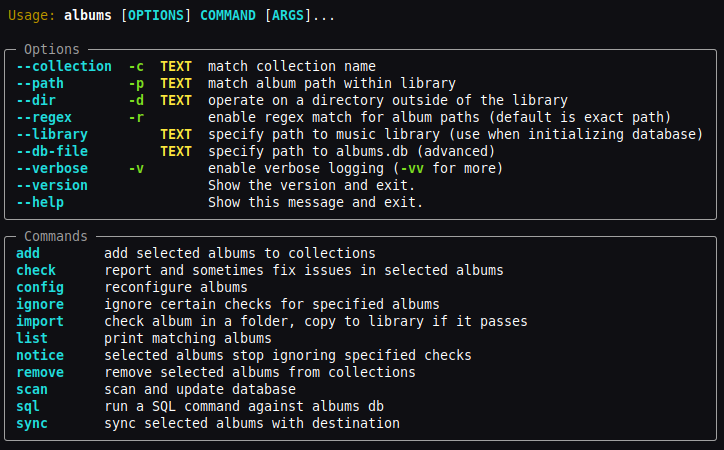

# Overview

`albums` is an interactive tool to manage a library of music: configurably
validate and fix tags and metadata, rename files, format and embed album art,
and sync parts of the library to digital audio players or portable storage

This documentation is for `albums` version **%%version_placeholder%%**.

## License

`albums` is free software, licensed under the terms of the
[GNU General Public License Version 3](https://github.com/4levity/albums/blob/main/COPYING)

## Getting started

Install with `pipx install albums` in an environment with Python 3.12 or newer.

Each album (soundtrack, mixtape...) is expected to be in a folder, or `albums`
won't be helpful. The rest of the folder structure doesn't matter.

Run `albums scan` to get started. It will ask you to confirm whether your music
library is in the default user home directory location (e.g. `~/Music`). If it
isn't, run `albums --library "/path/to/library" scan` instead. It may take
several minutes to index a large collection. See [Usage](./usage.md).

## Supported Formats

**FLAC**, **MP3/ID3** and **Ogg Vorbis** are supported. **M4A** and **WMA**
files are read but `albums` doesn't comprehend their tags yet so most checks are
skipped. JPEG, PNG and GIF files in the album folder are loaded as candidates
for cover art.

## System Requirements

Requires Python 3.12+. Primarily tested on Linux and Windows. Should work on
almost any 64-bit x86 or ARM system with Linux, macOS or Windows. (32-bit and
wider OS support possible by dropping `scikit-image` library used for measuring
image similarity.)
